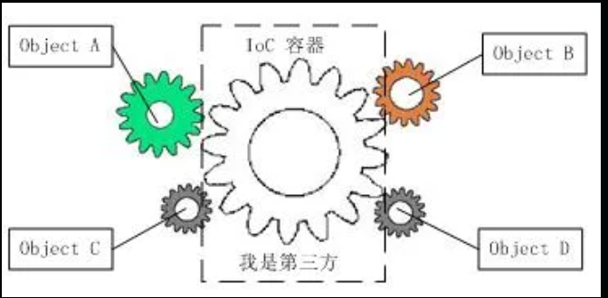

# 依赖注入与Go依赖注入解决方案uber/fx

## 对象间依赖

面向对象设计及编程的基本思想，简单来说就是把复杂系统分解成相互合作的对象，这些对象类通过封装后内部实现对外部是透明的，从而降低了解决问题的复杂度，而且服务可以灵活地被重用和扩展。但面向对象设计带来的最直接的问题，就是对象间的依赖。举例来说，在面向对象开发中，在A类里用到B类的实例化构造，就可以说A依赖于B，在没有引入IOC容器之前，对象A依赖于对象B，那么对象A在初始化或运行到某一点时，自己必须主动去创建对象B或者使用已经创建的对象B，这个直接依赖会导致的问题包括：
+ 过度暴露细节
  + A只关心B提供的接口服务，并不关系B的内部实现细节，A因为依赖而引入B类，间接的关心了B的实现细节(这一点在日常开发中经常遇见，在使用一个第三方包时经常需要关注包的实现细节)
+ 对象间强耦合
  + B发生任何变化都会影响到A，开发A和开发B的人可能不是一个人，B把一个A需要用到的方法参数改了，B的修改能编译通过，但是A无法运行
+ 扩展性差
  + A 是服务使用者，B 是提供一个具体服务的，假如 C 也能提供类似服务，但是 A 已经严重依赖于 B 了，想换成 C 非常之困难

学过面向对象的同学马上会知道可以使用接口来解决上面几个问题。如果早期实现类 B 的时候就定义了一个接口，B 和 C 都实现这个接口里的方法，这样从 B 切换到 C 是不是就只需很小的改动就可以完成。

A 对 B 或 C 的依赖变成对抽象接口的依赖了，上面说的几个问题都解决了。但是目前还是得实例化 B 或者 C，因为 new 只能 new 对象，不能 new 一个接口，还不能说 A 彻底只依赖于接口了。从 B 切换到 C 还是需要修改代码，能做到更少的依赖吗？能做到 A 在运行的时候想切换 B 就 B，想切换 C 就 C，不用改任何代码甚至还能支持以后切换成 D 吗？

通过反射可以简单实现上面的诉求。例如常用的接口NSClassFromString，通过字符串可以转换成同名的类。通过读取本地的配置文件，或者服务端下发的数据，通过 OC 的提供的反射接口得到对应的类，就可以做到运行时动态控制依赖对象的引入。

## 控制反转（Inversion of Control, IOC）

IOC理论：借助于“第三方”实现具有依赖关系的对象之间的解耦

由于引进了中间位置的“第三方”，使得A、B、C、D这4个对象没有了耦合关系，齿轮之间的传动全部依靠第三方。所以IOC容器成了整个系统的关键核心。软件系统在引入IOC容器之后，对象间依赖的情况就完全改变了，由于IOC容器的加入，对象A于对象B之间失去了直接联系，所以，当对象A运行到需要对象B的时候，IOC容器会主动创建一个对象B注入到对象A需要的地方。

所谓控制反转，举例来说，假设通过框架来实现——框架提供一个可扩展的代码骨架，用来组装对象，管理整个执行流程，程序员利用框架进行开发时，只需要往预留的扩展点上，添加跟自己业务相关的代码，就可以利用框架来驱动整个程序流程的执行。这里的“控制”指的是对程序执行流程的控制，而“反转”指的是在没有使用框架之前，程序员自己控制整个程序的执行。在使用框架之后，整个程序的执行流程可以通过框架来控制。流程的控制权由程序员“反转”到了框架。

控制反转并不是一种具体的实现技巧，而是一个比较笼统的设计思想，一般用来指导框架层面的设计。

## 依赖注入（DI）

依赖注入跟控制反转相反，是一种具体的编程技巧。对于这个概念，有一个形象的说法：依赖注入是一个标价25美元，实际上只值5美分的概念。也就是说虽然这个概念听起来很“高大上”，实际上，理解应用起来非常简单。

那到底什么是依赖注入呢，一句话概括来说：不通过new()的方式在类内部创建依赖类对象，而是将依赖的类对象在外部创建好之后，通过构造函数、函数参数等方式传递（或注入）给类使用。

依赖注入的目的，是为了将依赖对象的创建与依赖对象的使用分离，通俗讲就是使用方不负责服务的创建。

## 依赖注入框架

在不使用框架并采用依赖注入实现的模块中，创建对象、组装（或注入）对象的工作仅仅是被移动到了更上层代码，还是需要程序员自己来实现。

在实际的软件开发中，一些项目可能会涉及几十、上百、甚至几百个类，类对象的创建和依赖注入会变得非常复杂。如果这部分工作都是靠程序员写代码来完成，容易出错且开发成本非常高。而对象创建和依赖注入的工作，本身跟具体的业务无关，我们完全可以抽象成框架来自动完成。这个框架就是“依赖注入框架”，我们只需要通过依赖注入框架提供的扩展点，简单配置所有需要创建的类对象
、类与类之间的依赖关系，就可以实现由框架来自动创建对象、管理对象的生命周期、依赖注入等原本需要程序员来做的事情。

依赖注入将对象的创建逻辑，转移到了依赖注入框架中。一个类只需要定义自己的依赖，然后直接使用该依赖就可以，依赖注入框架负责创建、绑定、维护被依赖对象的生命周期。

## uber-go开源的fx框架

不用看网上的博客，可直接参考官方文档，里面写的非常详尽

https://pkg.go.dev/go.uber.org/fx#pkg-overview (首推)

https://uber-go.github.io/fx/get-started/index.html
