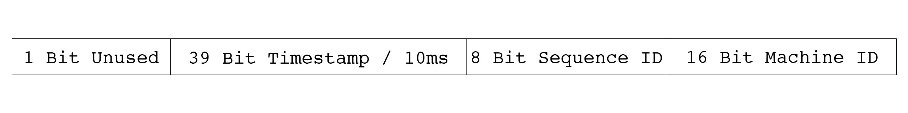

# sonyflake

## 基本介绍

在实际的业务中我们经常会遇到需要生成唯一ID的场景，在大多数场景中我们可以通过数据库的主键ID来生成唯一ID，但是唯一ID的生成的性能受限于数据库的性能。在一些更为复杂的场景下，甚至会用到分库分表的设计，这种情况下使用数据库的主键作为ID就会产生重复的ID。

这里我们介绍一种分布式唯一ID生成算法，[sonyflake](https://github.com/sony/sonyflake)，它是在雪花算法的基础上改进而来。

sonyflake生成的唯一ID的构成如下，包含39位构成的时间戳，其中每个时间戳单位表示10毫秒，中间8位表示序列ID，最后16位表示机器ID，因此每台机器每10毫秒只能生成256个唯一ID。

```shell
39 bits for time in units of 10 msec
 8 bits for a sequence number
16 bits for a machine id
```



sonyflake算法的优缺点如下：

+ 比snowflake更长的生命周期，174年>69年
+ 能运行在更多分布式机器上 2^16 > 2^10
+ 劣势：生成ID的速度比snowflake更慢，每10毫秒最多只能生成256个唯一ID。（解决方案：运行多个sonyflake实例、组成同一个ID）

## 源码解析

在调用`NextID`方法时会加锁，从而保证多个goroutine并发调用时不会产生重复的ID。current变量计算出当前的时间戳，即相比于开始时间经过了多少个10毫秒。

如果current比记录的sf.elapsedTime事件更大，直接将current设置为sf.elapsedTime、并将sequence设置为0；

如果current小于或等于记录的self.elapsedTime，等于一般发生在多个goroutine并发同时调用NextID方法，小于在机器发生时间回拨时会发生，此时递增序列号。**当序列号达到最大值（溢出），则等待下一个self.elapsedTime，并且sleep相应的时间，假如overtime为1，则sleep等待10毫秒**。

最后调用`toID`方法拼接成64位唯一ID。


```go
// NextID generates a next unique ID.
// After the Sonyflake time overflows, NextID returns an error.
func (sf *Sonyflake) NextID() (uint64, error) {
	const maskSequence = uint16(1<<BitLenSequence - 1)

	sf.mutex.Lock()
	defer sf.mutex.Unlock()

	current := currentElapsedTime(sf.startTime)
	if sf.elapsedTime < current {
		sf.elapsedTime = current
		sf.sequence = 0
	} else { // sf.elapsedTime >= current
		sf.sequence = (sf.sequence + 1) & maskSequence
		if sf.sequence == 0 {
			sf.elapsedTime++
			overtime := sf.elapsedTime - current
			time.Sleep(sleepTime((overtime)))
		}
	}

	return sf.toID()
}

func (sf *Sonyflake) toID() (uint64, error) {
	if sf.elapsedTime >= 1<<BitLenTime {
		return 0, ErrOverTimeLimit
	}

	return uint64(sf.elapsedTime)<<(BitLenSequence+BitLenMachineID) |
		uint64(sf.sequence)<<BitLenMachineID |
		uint64(sf.machineID), nil
}

```