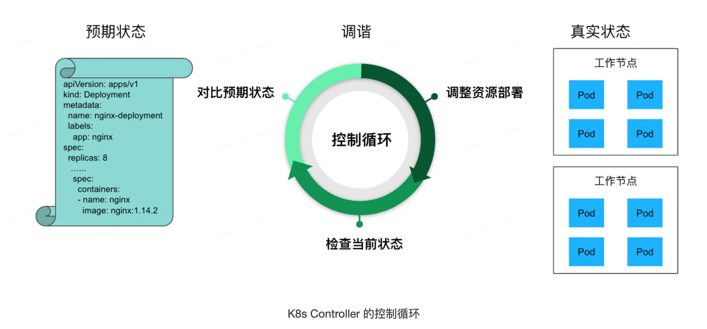
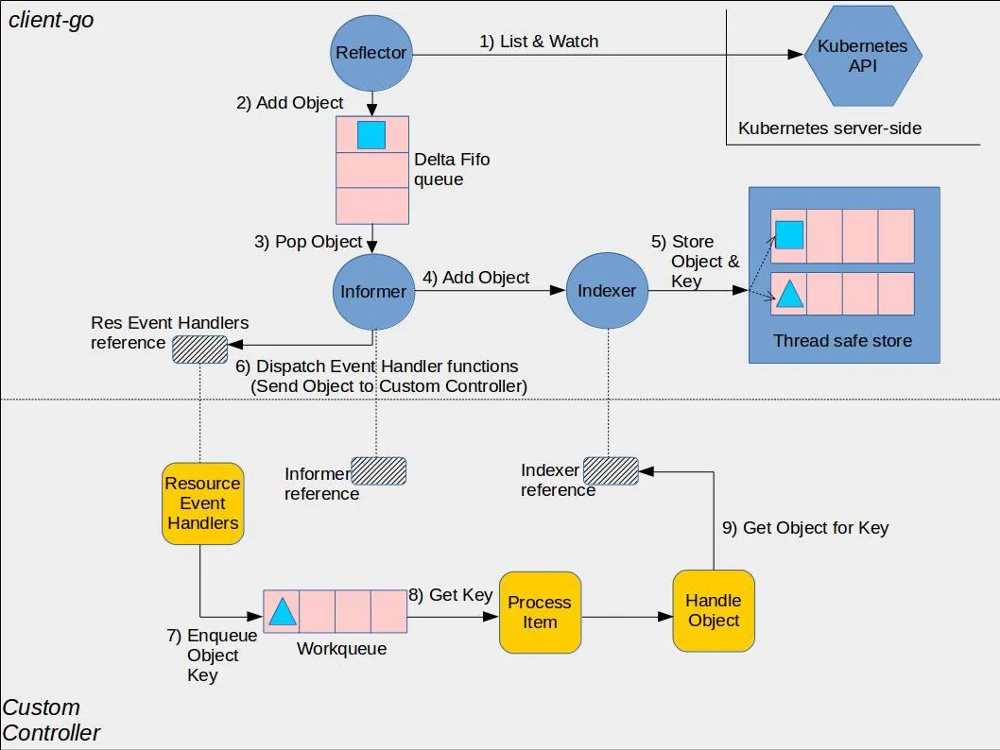

# client-go源码分析-开篇

在正式开始我们的client-go源码分析系列之前简单介绍一下为什么需要了解甚至是掌握client-go的原理。我们都知道k8s最重要的一个编排模式是-控制循环(control loop)或者说是调谐：用户通过"声明式api"定义资源对象的预期工作状态，控制器负责监视资源的实际状态，当资源的实际状态和预期状态不一致时，控制器负责对系统进行必要的修改，以确保两者一致。用一段伪代码来说明这一过程：

```go
for {
  实际状态 := 获取集群中对象X的实际状态（Actual State）
  期望状态 := 获取集群中对象X的期望状态（Desired State）
  if 实际状态 == 期望状态{
    什么都不做
  } else {
    执行编排动作，将实际状态调整为期望状态
  }
}
```
下面是一个实际的例子。比如说我们创建一个deployment声明需要8个pod实例，8个pod实例都调度运行起来，突然某个节点上的pod oom退出了，此时replicaSet控制器发现实际运行的pod只有7个，跟预期的副本数量不一致，就会重新创建起来一个新的pod。推而广之，不仅是deployment，一个pod从创建到运行都遵循着控制器模式。



控制器模式的背后，就是informer机制，理解了informer机制，也就理解了k8s的核心，而我们要分析的client-go库的核心也是informer机制。client-go是从kubernetes中移出来的一个基础库，当前已经集成到了大量的k8s组件和开发者编写的operator中，深入了解掌握client-go，不仅能帮助我们快速读懂k8s源码，同时能让我们在编写operator的过程中知其然更知其所以然，避免踩坑，写出高效运行的代码。

接下来我们来看一下informer机制的主要架构（是时候祭出这张广为流传的client-go、或者说是informer机制的架构图了:-）



怎么看这个架构图呢。这个图让我想到了一个词，叫"冰山一角"，作为client-go库的使用者，我们所看到的只是冰山露出水面的很小的一部分，而更多的内容都隐藏在水下，只有我们不断去挖掘才能识得庐山真面目。这个图分为两个部分，上半部分是client-go库的底层运行机制，下半部分是暴露给使用者的接入点，在client-go的框架下，用户只需要编写少量的业务逻辑代码即可完成自定义controller的编写。

图中，蓝色标识的部分是client-go的核心组件，粉色标识的是client-go组件对外提供的工具库（可以直接import到external项目作为一个工具包来使用），黄色是client-go暴露给用户的接入点，也就是说用户在编写一个控制器时需要关心并编写代码的部分。

这里介绍几个核心组件：

+ Reflector: 初始list全量拉取、接下来监控(watch)指定的k8s资源，当监控的资源发生变化时，触发相应的变更事件，如Add/Update/Delete事件扔到本地的FIFO队列DeltaFIFO中
+ DeltaFIFO: 生产者-消费者队列，先进先出，Delta是一个资源对象存储，保存资源对象的操作类型，如Add/Update/Delete/Sync等操作类型
+ Indexer: client-go用来存储资源对象并自带索引功能的本地缓存。Informer作为中间的桥梁，从DeltaFIFO队列Pop出来资源对象的操作变更，同步到本地线程安全的缓存中，从而保证本地cache与k8s etcd数据一致。这样我们就可以很方便的通过Indexer操作接口从本地缓存中读取资源对象，避免直接访问远端的kube-apiserver造成服务端的压力

最后呢，我们以一个Pod删除为例串起整个流程：

1. reflector从kube-apiserver全量拉取所有pod资源对象，包成Add类型的事件放入到DeltaFIFO队列
2. informer从DeltaFIFO队列中取出Add事件，通过Indexer将全量Pod资源对象写入到本地缓存中
3. 业务代码中使用client-go的lister接口提供的方法将直接从本地缓存中获取相应的资源对象
4. reflector开始监听Pod资源对象的事件，此时如果一个pod被删除了，reflector将会打包对应pod资源对象的Delete事件扔到DeltaFIFO队列
5. informer通过indexer接口删除对应的pod资源对象
6. (用户代码)在用户注册对应的ResourceEventHandler情况下，执行handler代码，将Pod对象的key放入到workqueue队列缓存，从而支持异步消费、提升性能
7. (用户代码)从workqueue中取出pod资源对象的key,从本地缓存查询这个key, 如果查不到，说明Pod被删除了，执行pod删除对应的控制器逻辑。如ReplicaSet控制器会重新创建一个Pod

以上就是client-go源码分析的概述，我们讲解了为什么需要深入了解client-go的源码以及client-go的整体架构图、工作流程。在后面的博文中，将进一步对client-go的核心组件做源码级的分析和讲解，敬请关注。