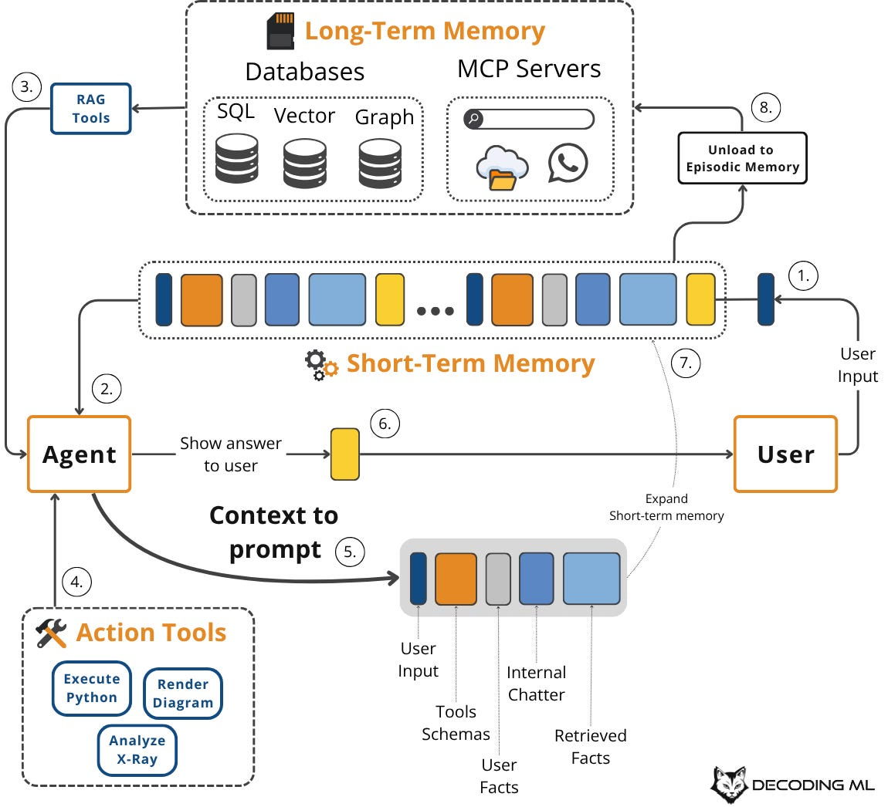
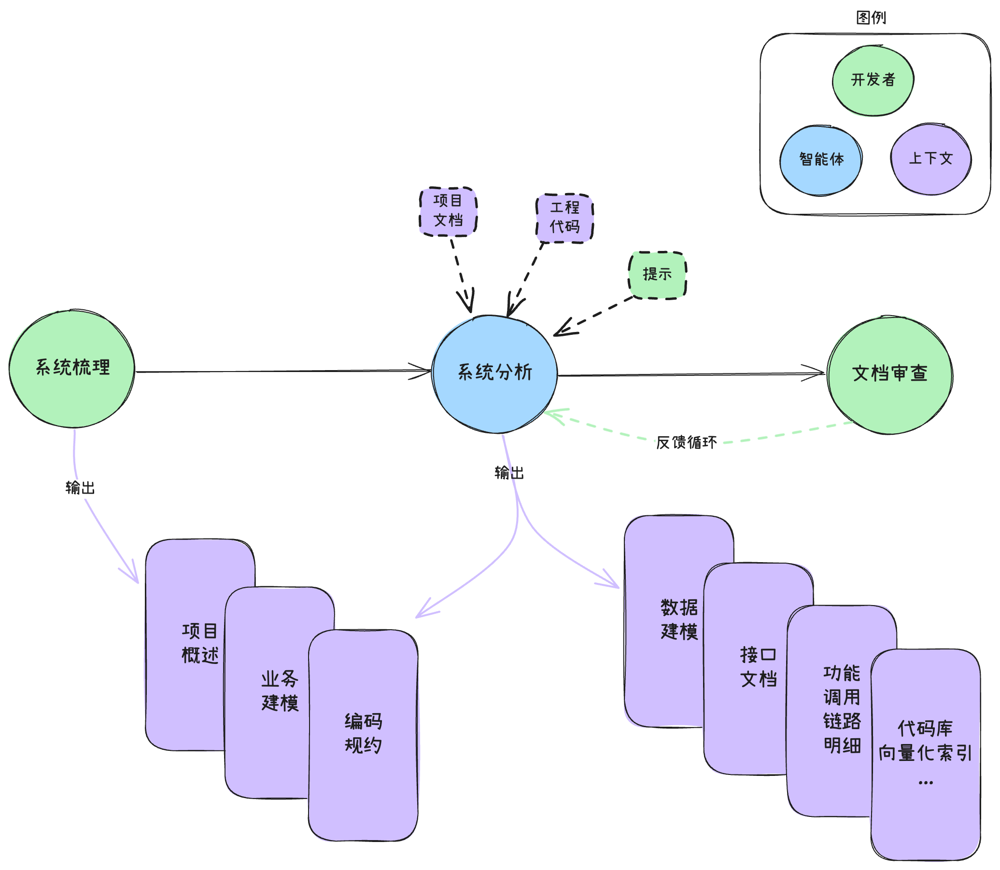
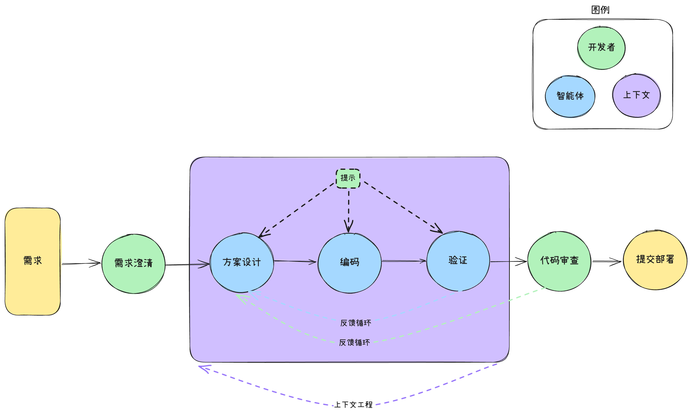

# Agent Coding

## 概念

### 规则

规则(Rules)为智能体编码提供系统级的指示，它们是项目的持久上下文。规则负责告诉智能体在代码库里该怎么做、用什么风格、遵循哪些流程，这些规则会被持久化保存，并自动注入到每次AI生成或编辑代码的上下文中。主流AI IDE通常支持用户自定义规则文件的生效时机，例如模型决策、指定文件、全局生效等类型。

### 记忆

记忆是根据聊天中的对话自动生成的上下文，当规则与记忆产生冲突时，规则的优先级通常更高。自动生成的上下文信息如偏好的日志格式、某个模块的特殊处理逻辑等。以Cursor为例，它提供两种创建记忆的方式：
1. 辅助观察：Cursor采用辅助观察的模式，即另一个模型观察对话并自动提取相关记忆。这个过程在工作时在后台被自动打开。后台生成的记忆需要用户批准才能保存，以确保对记忆内容的信任和控制；
2. 工具调用：当明确要求智能体记住某些事情或当代理注意到应为未来会话保留的重要信息时，代理可以使用工具调用直接创建记忆。

### MCP：与外部工具交互的通用USB接口

MCP协议（Model Collaboration Protocol）是 AI IDE 与外部工具交互的 “通用 USB 接口”，核心价值在于打破工具壁垒，让大模型可以访问不同的工具与数据源。通过 MCP，AI IDE 不再局限于代码生成，还能：
+ 执行命令：比如调用终端运行测试、查询 Git 历史；
+ 读取数据：如获取天气、解析网页、访问数据库；
+ 一键部署：生成代码后自动触发构建和上线流程。

### 上下文管理

AI IDE通过**基于RAG(检索增强生成)的代码库感知**，让模型真正理解整个项目的结构和逻辑。它具体是如何做到的？
+ 自动建索引：系统会把你的代码库按函数、类等逻辑单元切分，用 Embedding 模型（如 OpenAI 的 text-embedding）转换成向量，存入轻量级向量数据库；
+ 语义化检索：当你提出需求（比如“实现用户登录”），AI 不仅靠关键词匹配，而是通过语义理解，自动找出相关的权限校验、会话管理或错误处理代码；
+ 实时同步更新：一旦你修改了代码，索引会自动刷新，确保 AI 始终基于最新版本提供建议，不会引用已被删除或重构的逻辑。

### 自动编程

理解需求，规划任务，编写代码，验证代码。

## 实战进阶

### （1）项目上下文初始化

在开始智能体编程之前，需要对项目的上下文进行初始化，具体的流程如下：
1. 开发者沉淀基础项目知识为结构化的规则文档（业务建模、编码规约等），连同工程代码转换为上下文：编码规范，领域知识，专家经验；
2. 开发者通过提示词引导智能体基于已有上下文输出更多项目知识：根据第一步的输入以及项目代码引导模型输出更多的项目知识，如API文档、数据库设计（实体关系模型）、模块分析等；
3. 开发者对智能体输出的项目知识进行审查，多次迭代，直至所需项目知识转换为上下文，最终沉淀为Rules下的持久化上下文内容。

### （2）上下文驱动的开发流程

上下文驱动的开发流程：
1. 开发者用技术视角对需求进行分析、拆解与澄清；
2. 开发者通过提示词引导智能体基于已有上下文输出技术实现方案、编写代码并进行验证；
3. 智能体代码验证与人工代码审查发现的问题通过反馈循环进行修正，同步按需补充上下文，直至代码全部通过审查。